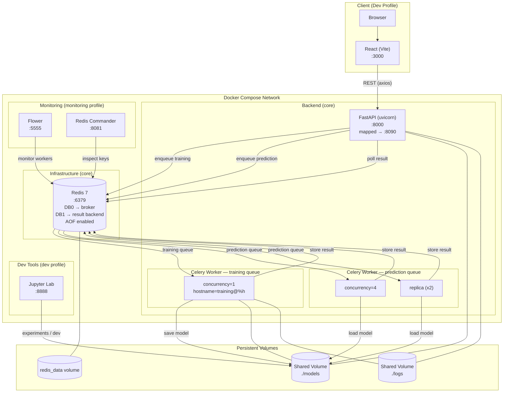
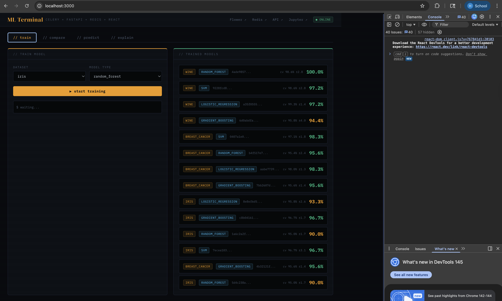
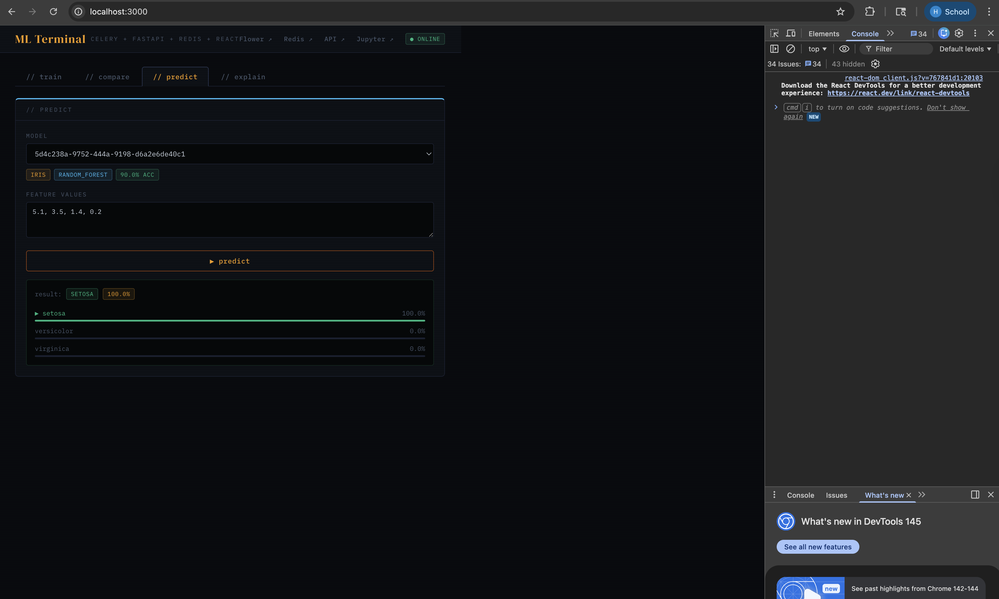
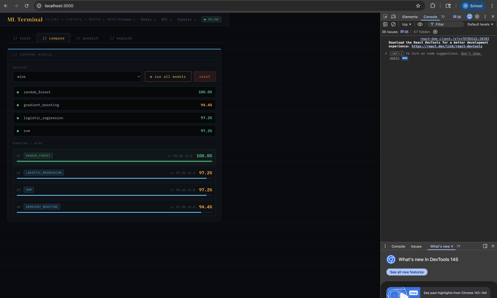
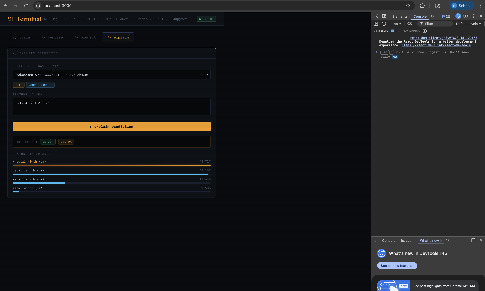

# ML_Celery_Project

ML training and prediction with Celery + FastAPI + Redis + React.

## Architecture



---

## Stack

| Layer          | Technology                |
| -------------- | ------------------------- |
| API            | FastAPI                   |
| Task Queue     | Celery                    |
| Broker / Cache | Redis                     |
| ML             | scikit-learn              |
| Monitoring     | Flower + Redis Commander  |
| Notebooks      | Jupyter (scipy-notebook)  |
| Frontend       | React + TypeScript + Vite |
| Containers     | Docker + Docker Compose   |

---

## Screenshots







## Quick Start

### With Docker (recommended)

```bash
# everything — includes Jupyter + Frontend
make up-dev
```

Then open http://localhost:3000 and run your experiments from the frontend.

| Service            | URL                                   |
| ------------------ | ------------------------------------- |
| API                | http://localhost:8090                 |
| API Docs (Swagger) | http://localhost:8090/docs            |
| Flower             | http://localhost:5555                 |
| Redis Commander    | http://localhost:8081                 |
| Jupyter            | http://localhost:8888?token=mlproject |
| Frontend           | http://localhost:3000                 |

### Without Docker

```bash
# install dependencies
pip install -r requirements.txt

# start Redis (required)
redis-server

# start training worker
celery -A celery_app worker --queues=training --concurrency=1 --loglevel=info

# start prediction worker
celery -A celery_app worker --queues=prediction --concurrency=4 --loglevel=info

# start API
uvicorn api.routes:app --reload --port 8090

# optional — monitor tasks
celery -A celery_app flower
```

---

## Docker Compose Profiles

Services are grouped into profiles so you only run what you need:

| Profile      | Services                                       |
| ------------ | ---------------------------------------------- |
| `core`       | redis, api, worker-training, worker-prediction |
| `monitoring` | core + flower, redis-commander                 |
| `dev`        | monitoring + jupyter, frontend                 |

```bash
make up              # core
make up-monitoring   # core + monitoring
make up-dev          # everything
```

---

## Make Targets

### Docker

```bash
make up              # start core services
make up-monitoring   # start core + monitoring tools
make up-dev          # start all services including Jupyter and frontend
make down            # stop and remove containers
make stop            # stop containers without removing
make restart         # restart all running containers
make rebuild         # rebuild images from scratch and restart
make logs            # tail logs for all services
make ps              # show running containers
make clean           # remove containers, local images, orphans
make volumes-rm      # remove all volumes — WARNING: wipes Redis data
```

### Experiments (conda)

```bash
# first time — create the conda environment
make env-create

# run experiments
make run                                        # iris + random_forest (default)
make custom DATASET=wine MODEL=gradient_boosting
make compare                                    # all models on breast_cancer
make benchmark                                  # all 16 dataset × model combinations
make save                                       # digits + svm, save to results.json

# cleanup
make env-clean   # remove __pycache__ and results.json
make env-delete  # delete the conda environment
```

---

## API Endpoints

### Training

| Method | Endpoint                 | Description               |
| ------ | ------------------------ | ------------------------- |
| `POST` | `/train`                 | Submit async training job |
| `GET`  | `/train/{job_id}/status` | Poll training progress    |

### Prediction

| Method | Endpoint                      | Description                                     |
| ------ | ----------------------------- | ----------------------------------------------- |
| `POST` | `/predict/{model_id}`         | Single prediction (waits 10s, falls back async) |
| `POST` | `/predict/{model_id}/batch`   | Async batch prediction                          |
| `POST` | `/predict/{model_id}/explain` | Prediction + feature importances                |
| `GET`  | `/model/{model_id}/info`      | Model metadata                                  |

### Tasks

| Method | Endpoint            | Description         |
| ------ | ------------------- | ------------------- |
| `GET`  | `/result/{task_id}` | Poll any async task |
| `GET`  | `/health`           | Health check        |

### Example — train and predict

```bash
# submit training job
curl -X POST http://localhost:8090/train \
  -H "Content-Type: application/json" \
  -d '{"dataset": "iris", "model_type": "random_forest"}'

# poll status
curl http://localhost:8090/train/{job_id}/status

# predict
curl -X POST http://localhost:8090/predict/{job_id} \
  -H "Content-Type: application/json" \
  -d '{"input_data": {"features": [5.1, 3.5, 1.4, 0.2]}}'
```

---

## Available Datasets and Models

### Datasets

| Name            | Samples | Features | Classes |
| --------------- | ------- | -------- | ------- |
| `iris`          | 150     | 4        | 3       |
| `wine`          | 178     | 13       | 3       |
| `breast_cancer` | 569     | 30       | 2       |
| `digits`        | 1797    | 64       | 10      |

### Models

| Name                  | Type                              |
| --------------------- | --------------------------------- |
| `random_forest`       | Ensemble — incremental warm-start |
| `gradient_boosting`   | Ensemble — incremental warm-start |
| `logistic_regression` | Linear — single fit               |
| `svm`                 | Kernel — single fit               |

---

## Project Structure

```
ml_celery_project/
├── api/
│   └── routes.py                   # FastAPI routes
├── ml/
│   ├── trainer.py                  # ModelTrainer — training logic
│   └── predictor.py                # ModelPredictor — prediction + explanation
├── tasks/
│   ├── training.py                 # Celery training task
│   └── prediction.py               # Celery prediction tasks
├── tests/
│   ├── test_ml_pipeline.py         # Standalone ML tests (no Celery needed)
│   └── run_experiment.py           # Full stack experiment runner
├── notebooks/                      # Jupyter notebooks (git-ignored, volume-mounted)
├── models/                         # Saved model artifacts (git-ignored, volume-mounted)
├── logs/                           # Worker logs (git-ignored, volume-mounted)
├── frontend/
│   ├── src/
│   │   ├── api/
│   │   │   └── client.ts           # Typed axios + RxJS API client
│   │   ├── components/             # Reusable UI components
│   │   │   ├── Badge.tsx
│   │   │   ├── Button.tsx
│   │   │   ├── Card.tsx
│   │   │   ├── MetricCard.tsx
│   │   │   ├── ProgressBar.tsx
│   │   │   ├── Select.tsx
│   │   │   └── TerminalLog.tsx
│   │   ├── hooks/
│   │   │   ├── useApiHealth.ts     # API health check observable
│   │   │   ├── useCompare.ts       # Run all models in parallel — forkJoin
│   │   │   ├── useExplain.ts       # Feature importance requests
│   │   │   ├── usePredict.ts       # Single prediction requests
│   │   │   └── useTraining.ts      # Training job + RxJS poll stream
│   │   ├── panels/
│   │   │   ├── ComparePanel.tsx
│   │   │   ├── ExplainPanel.tsx
│   │   │   ├── Header.tsx
│   │   │   ├── ModelsPanel.tsx
│   │   │   ├── PredictionPanel.tsx
│   │   │   └── TrainingPanel.tsx
│   │   ├── styles/
│   │   │   ├── components.css
│   │   │   ├── global.css
│   │   │   ├── panels.css
│   │   │   └── theme.ts
│   │   ├── types/
│   │   │   └── index.ts            # All shared TypeScript types
│   │   ├── App.tsx
│   │   ├── config.ts               # Service URLs from VITE_ env vars
│   │   └── main.tsx
│   ├── .env.example                # Frontend env var template
│   ├── Dockerfile.frontend
│   └── package.json
├── celery_app.py                   # Celery app + queue configuration
├── Dockerfile
├── .dockerignore
├── docker-compose.yml
├── requirements.txt
├── Makefile
└── .env.example
```

---

## Jupyter Notebooks

Jupyter runs the official `jupyter/scipy-notebook` image. The project code is mounted directly so you can import from `ml/` without any extra installs:

```python
import sys
from pathlib import Path

sys.path.insert(0, str(Path.cwd().parent))

from ml.trainer import ModelTrainer
from ml.predictor import ModelPredictor
```

Access at: http://localhost:8888?token=mlproject

---

## Environment Variables

### Backend — copy `.env.example` to `.env`

```bash
cp .env.example .env
```

| Variable         | Default                | Description                      |
| ---------------- | ---------------------- | -------------------------------- |
| `REDIS_URL`      | `redis://redis:6379/0` | Celery broker URL                |
| `RESULT_BACKEND` | `redis://redis:6379/1` | Celery result backend            |
| `MODEL_DIR`      | `models/`              | Directory to save trained models |

### Frontend — copy `frontend/.env.example` to `frontend/.env`

```bash
cp frontend/.env.example frontend/.env
```

| Variable                   | Default                                 | Description             |
| -------------------------- | --------------------------------------- | ----------------------- |
| `VITE_API_URL`             | `http://localhost:8090`                 | FastAPI base URL        |
| `VITE_FLOWER_URL`          | `http://localhost:5555`                 | Flower dashboard        |
| `VITE_REDIS_COMMANDER_URL` | `http://localhost:8081`                 | Redis Commander         |
| `VITE_JUPYTER_URL`         | `http://localhost:8888?token=mlproject` | Jupyter notebook server |
